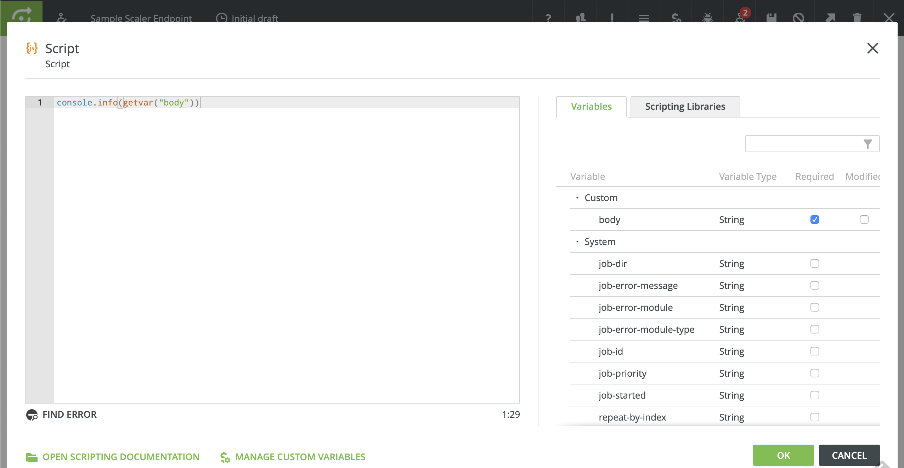

# Integrating Apache Kafka with Inspire Scaler

## Introduction

Explain the purpose, provide an overview

## Solution Overview

High-level description

### Architecture

Picture

### Solution Components

#### Apache Kafka

Blurb on Kafka

#### Apache Camel

Blurb on Camel

#### Spring Boot

Blurb on Spring

## How-To Guide

The instructions in this section provide a step by step walk-through the process of creating and configuring a Spring Boot application using Apache Camel to provide a gateway to Inspire Scaler. A full copy of the completed project and its assets can be found LINK_HERE.


### Pre-requisites

This guide assumes that the following software is properly installed and configured on the machine being used. For more information, please see the installation links provided.

* A **Java JDK for version 8** with the latest updates. At the time of this writing, that is 8u222-b10. Given the recent change in [Oracle's licensing terms for Java](https://www.oracle.com/technetwork/java/javase/terms/license/javase-license.html) releases, there are new restrictions around what activities are permitted and a lot of uncertainty around what constitues "development". As such, [Azul System's](https://www.azul.com) Zulu Community builds of OpenJDK provide a great cross-platform alternative. So, if you do not already have a JDK installed, see the [Zulu Community download page](https://www.azul.com/downloads/zulu-community/) to find the latest version 8 JDK for your platform.

* **Inspire Scaler** running locally and using default port (30600). A remote Scaler server will work as long as the appropriate host name and port are substituted where *localhost:30600* is used in the instructions. This guide was created and tested with Scaler v12.5.0.18-FMAP.

* The **[Docker Engine](https://docs.docker.com/)** and the **[Docker Compose](https://docs.docker.com/compose/) tool** for defining and building multi-container Docker applications. This step is optional if you are not using the [Docker demo environment](#using-the-docker-demo-environment) described later in this document. See the multi-platform installation instructions available for the [Docker Engine](https://docs.docker.com/install/) and [Docker Compose](https://docs.docker.com/compose/install/) tool, respectively. The latest stable version for your platform is recommended but any Docker Engine release after 17.12.0 should work (the compose file uses format version 3.5). This guide was prepared and tested with Docker Engine version 18.09.2 and Docker Compose version 1.23.2.

* The latest binary download of **[Apache Kafka](https://kafka.apache.org/)** (currently 2.3.0). See the [Kafka download page](https://kafka.apache.org/downloads) for more information. If Docker is already installed, there is an option to use Docker images in lieu of installing Kafka. This is not recommended unless you are familiar with Docker and how networking and volume creation work.


### Create an Inspire Scaler Workflow

In many cases, the Scaler workflow(s) we will need to integrate with (invoke) will already exist. For this guide, we will create a simple workflow with only those items needed to prove the efficacy of the process.

1. To begin, access the user interface for local instance of Scaler at [http://localhost:30600](http://localhost:30600).

2. Log in as an administrator and create a new *On Demand* workflow. Our example will be named *Simple Scaler Endpoint*.

3. Using the workflow editor, add three Scaler workflow components in this order:
   * HTTP Input
   * Script
   * HTTP Output
  
   You can either drag and drop the components from the pallette to the canvas or just double-click them in the pallette to move them over. Once finished, make sure that the components are all linked together in the aforementioned order.


4. Edit the **HTTP Input** component. Enter *simplews* for the *URL Endpoint* and set the *API authentication group* to *no authentication*. Take note of the *Request URL*. We will need this information later in order to contact this workflow via HTTP. Be sure to click *OK* to close the component detail popup and not the *X* so that the changes made will be persisted in memory.


5. Open the **Script** component. In the *Variables* tab, click the *Required* checkbox for the *body* variable.

6. Add a simple line of script, `console.info(getvar("body"))`, in the code area. This will allow us to see exactly what was passed to Scaler in the body of the HTTP request from the *Job* details once the request is completed. Click *OK* to close the window.



7. Edit the **HTTP Output** component, setting the *Response Type* to *Confirmation (HTTP 204)* before clicking *OK*.

8. At this point, our workflow is complete. Click the *disk* icon in the toolbar to save all of the in-memory changes to the database and the *up and right arrow* nearby to publish the initial draft of the workflow as version 1. Click *OK* to confirm.

9.  With the *Sample Scaler Endpoint* workflow selected in the *On Demand* workflows screen, click the *play* icon in the toolbar to deploy the workflow.


### Create a Topic in Apache Kafka

For simplicity's sake, this section is written as though the [Docker demo environment](#using-the-docker-demo-environment) is being used. If this is not the case and you have your own Kafka/Zookeeper environment available, please adjust the command parameters below and throughout the rest of this guide as appropriate.

Open a terminal window or command prompt and switch to the directory you installed Kafka to. To create a topic to use for passing messages to Scaler, run one of the following script with the supplied parameters based on your operating system:

*MacOS & Linux* 
```console
> bin/kafka-topics.sh --bootstrap-server localhost:9092 --create --topic inspire --replication-factor 1 --partitions 1
```

*Windows* 
```console
> bin\windows\kafka-topics.bat --bootstrap-server localhost:9092 --create --topic inspire --replication-factor 1 --partitions 1
```

If you would like to verify that the topic was properly created, you can use the command with the `--list` parameter and you should see `inspire` listed among the output.

*MacOS & Linux* 
```console
> bin/kafka-topics.sh --bootstrap-server localhost:9092 --list
```

*Windows* 
```console
> bin\windows\kafka-topics.bat --bootstrap-server localhost:9092 --list
```

As mentioned previously, there is an option to use a Docker container based on the same Kafka image used for the demo environment in lieu of installing Kafka's binary distribution. For example, to create the topic in Kafka, you could execute the following:

```console
> docker run --rm --network kafka-demo confluentinc/cp-kafka \
>   kafka-topics --zookeeper zookeeper:2181 --create \
>   --topic inspire --replication-factor 1 --partitions 1 
```

**Important**: Because the [Confluent Platform](https://www.confluent.io/product/confluent-platform/) image for Kafka defines three volume mount-points, each time a `docker run` command using the image is executed, three new Docker volumes are created. Even though these volumes are very small in size, this can lead to the creation of plethora of Docker volumes without an associated container. In order to make sure that these are cleaned up, use a Docker command similar to the following (adjust as appropriate for your operating system):

```console
> docker volume rm $(docker ls -qf dangling=true)
```


### Create a Spring Boot project with Spring Initializr

1. In the browser, navigate to the Spring Initializr at [https://start.spring.io](https://start.spring.io).


2. Choose *Gradle Project* as the type of project and leave the *Language* and *Spring Boot* settings at their default.

3. Feel free to customize the name and description values in the *Project Metadata* section as appropriate. For the purposes of this walk-through, please do not change the *Packaging* or *Java* selections from *Jar* and *8*, respectively.

4. In the *Dependencies* section, type in '`camel`' and click the plus sign to add *Apache Camel*.

5. Click *Generate the project* to download a ZIP file containing the Spring Boot project structure and files that have been created according to the previous choices. Later on, we'll customize the project's configuration to build and run a Java application.

6. Expand (unzip) the project to a directory on disk. This will now be referred to as the `${project_root}` directory.


### Configure Apache Camel


### Build and Run the Application


### Send a Message to Kafka


### Verify Scaler Received the Message


## Using the Docker Demo Environment
In order to provide ready access to a Kafka environment for testing this integration, a Docker Compose file that creates a single-node instance of Apache Kafka along with an Apache Zookeeper server is included with the project assets. The Zookeeper server is required by Kafka to support many of the distributed features (leader elections, partitions, etc.).

To start the demo environment, from a console terminal or command window in the project root directory, execute:
```console
> docker-compose up -d
```

This will create a network and start both server instances in *daemon* or background mode. By default, Kafka's primary listener will be bound to port `9092` of the host machine (`localhost:9092`). Because of the peculiarities of networking with Docker, a second listener has been configured to run on port `29092`. If you plan to connect to the demo Kafka server from another container (internal to Docker, on the `kafka-demo` network), you will need to use `kafka:29092` for the commands or parameters that require supplying the address of the Kafka broker.

## Areas for Further Study and/or Investigation

### Calling Scaler with Authentication Enabled